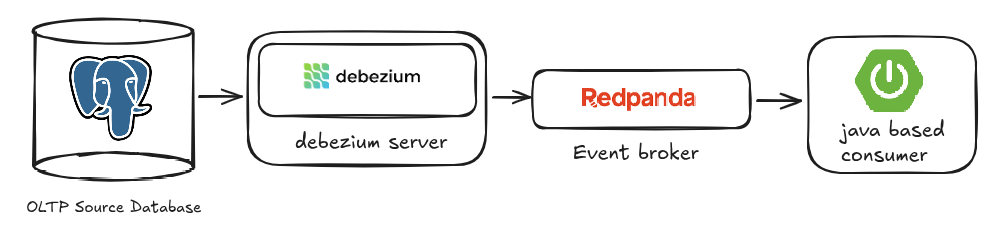

# CDC Consumer Project (Work in Progress)

This project demonstrates a **real-time Change Data Capture (CDC) pipeline** using PostgreSQL, Debezium, Redpanda, and a Java Spring Boot consumer.  

## Overview

The pipeline captures changes (insert/update/delete) from the PostgreSQL database and streams them through Redpanda (Kafka-compatible broker). A Java application consumes these events for further processing.  

## Workflow (until now)

## Tools

| Tool                 | Role                                                                 |
|---------------------|----------------------------------------------------------------------|
| **PostgreSQL**      | Source OLTP database with customers, products and orders schemas. |
| **Debezium**        | Captures CDC events from PostgreSQL and publishes to Redpanda.       |
| **Redpanda**        | Kafka-compatible broker to transport CDC events in real-time.        |
| **Java Spring Boot**| Consumes CDC events, processes/logs them, and prepares them for dashboard analytics. |
